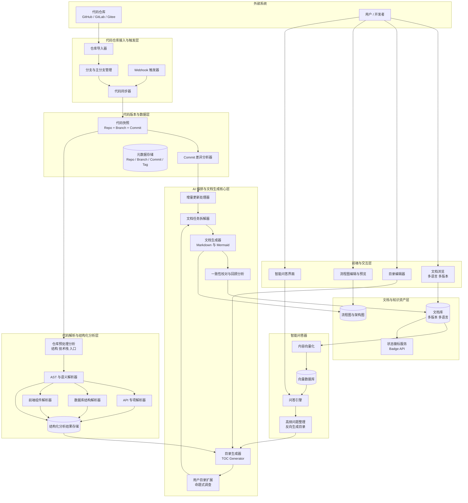

# openDeepWiki

[English](./README_EN.md) | 简体中文

## 项目简介

openDeepWiki 是一个基于 AI 的代码仓库智能解读平台，能够自动分析任意 GitHub 代码仓库，并生成结构化的项目文档。通过结合静态代码分析和大语言模型（LLM），帮助开发者快速理解开源项目的架构、API 和业务流程。

## 🌟 在线体验

[https://opendeepwiki.fly.dev/](https://opendeepwiki.fly.dev/)

无需安装配置，立即体验 openDeepWiki 的强大功能！

## 核心特性

- 🚀 **一键分析**：输入 GitHub URL，自动克隆并解读代码仓库
- 📊 **智能解读**：静态分析 + LLM 深度分析，生成结构化文档
- 📝 **标准化输出**：自动生成项目概览、架构分析、核心接口、业务流程、部署配置五大文档
- 🔄 **任务管理**：可视化任务执行进度，支持单独运行、重试和强制重置
- 📖 **在线阅读**：内置 Markdown 渲染，支持文档在线编辑和导出
- 🌐 **多源支持**：支持公开仓库和私有仓库（需配置 GitHub Token）
- 🎨 **现代化界面**：基于 React + Ant Design，支持多语言和主题切换

## 技术栈

### 后端
- **语言**：Go 1.24+
- **框架**：Gin
- **数据库**：SQLite（默认）/ MySQL
- **ORM**：GORM
- **日志**：klog
- **开发工具**：Air（热重载）

### 前端
- **框架**：React 19 + TypeScript
- **构建工具**：Vite
- **UI 组件**：Ant Design 6
- **Markdown 渲染**：react-markdown / react-md-editor
- **路由**：React Router 7

### AI 集成
- 支持 OpenAI 兼容接口
- 可配置 API 地址、模型和 Token
- 支持通过环境变量配置

## 快速开始

### 环境要求

- Go 1.24+
- Node.js 18+
- Git

### 安装步骤

```bash
# 1. 克隆项目
git clone https://github.com/yourusername/openDeepWiki.git
cd openDeepWiki

# 2. 安装依赖
make setup

# 3. 初始化配置
make init-config

# 4. 编辑配置文件，设置 LLM API Key
vim backend/config.yaml
# 或设置环境变量
export OPENAI_API_KEY="your-api-key"
export OPENAI_BASE_URL="https://api.openai.com/v1"
export OPENAI_MODEL_NAME="gpt-4o"
```

### 启动服务

```bash
# 开发模式（推荐）：同时启动前后端，支持热重载
make dev

# 或分别启动
make air           # 后端（带热重载）
make run-frontend  # 前端

# 生产模式
make build
make run-backend
```

### 访问地址

- 前端页面：http://localhost:5173
- 后端 API：http://localhost:8080

## 使用指南

### 1. 配置 LLM

首次使用需要配置 LLM API：

**方式一：通过配置文件**

编辑 `backend/config.yaml`：

```yaml
llm:
  api_url: "https://api.openai.com/v1"
  api_key: "your-api-key"
  model: "gpt-4o"
  max_tokens: 4096
```

**方式二：通过环境变量（推荐）**

```bash
export OPENAI_API_KEY="your-api-key"
export OPENAI_BASE_URL="https://api.openai.com/v1"
export OPENAI_MODEL_NAME="gpt-4o"
```

**方式三：通过前端界面**

访问 `http://localhost:5173/config` 进行配置。

### 2. 解读代码仓库

1. 在首页输入 GitHub 仓库 URL（支持 https 和 git@ 格式）
2. 点击「添加」，系统自动克隆仓库
3. 克隆完成后，点击「执行所有任务」开始分析
4. 等待任务执行完成（5 个任务：概览、架构、接口、业务流程、部署）
5. 点击「查看文档」阅读生成的结果

### 3. 文档管理

- **在线阅读**：左侧导航树，右侧 Markdown 渲染
- **在线编辑**：点击「编辑」按钮修改文档内容
- **导出文档**：支持单个文档或整体打包导出

## 项目结构

```
openDeepWiki/
├── backend/              # Go 后端
│   ├── cmd/server/      # 入口文件
│   ├── config/          # 配置管理
│   ├── internal/
│   │   ├── handler/     # HTTP 处理器
│   │   ├── model/       # 数据模型
│   │   ├── repository/  # 数据访问层
│   │   ├── service/     # 业务逻辑层
│   │   │   └── analyzer/ # 分析引擎（静态分析 + LLM）
│   │   ├── router/      # 路由配置
│   │   └── pkg/         # 工具包（git/llm/database）
│   ├── go.mod
│   └── config.yaml.example
├── frontend/             # React 前端
│   ├── src/
│   │   ├── components/  # 通用组件
│   │   ├── pages/       # 页面组件
│   │   ├── services/    # API 调用
│   │   ├── i18n/        # 国际化
│   │   └── types/       # TypeScript 类型
│   └── package.json
├── doc/                 # 项目文档
│   ├── 开发规范/
│   └── 需求/
├── Makefile             # 构建脚本
└── README.md            # 本文件
```

## 生成的文档类型

每个仓库解读后会生成以下 5 份文档：

| 文档名称 | 文件名           | 内容说明                         |
| -------- | ---------------- | -------------------------------- |
| 项目概览 | overview.md      | 项目基本信息、技术栈、目录结构   |
| 架构分析 | architecture.md  | 整体架构、模块划分、依赖关系     |
| 核心接口 | api.md           | API 接口、函数签名、模块间调用   |
| 业务流程 | business-flow.md | 核心业务逻辑、数据流程           |
| 部署配置 | deployment.md    | 配置文件说明、部署方式、环境要求 |

## 配置说明

完整配置示例（`config.yaml`）：

```yaml
server:
  port: "8080"
  mode: "debug"  # debug 或 release

database:
  type: "sqlite"  # sqlite 或 mysql
  dsn: "./data/app.db"

llm:
  api_url: "https://api.openai.com/v1"
  api_key: ""  # 推荐使用环境变量
  model: "gpt-4o"
  max_tokens: 4096

github:
  token: ""  # 用于访问私有仓库

data:
  dir: "./data"
  repo_dir: "./data/repos"
```

## 常用命令

```bash
# 开发
make dev              # 开发模式（前后端 + 热重载）
make air              # 后端热重载
make run-frontend     # 前端开发服务器

# 构建
make build            # 构建前后端
make build-backend    # 仅构建后端
make build-frontend   # 仅构建前端

# 清理
make clean            # 清理构建产物

# 其他
make setup            # 安装依赖
make init-config      # 初始化配置文件
```

## 系统架构



## 开发规范

项目遵循严格的开发规范，详见：

- [后端开发规范](./doc/开发规范/后端规范/)
- [前端开发规范](./doc/开发规范/前端规范/)

## 后续规划

- [ ] Docker 容器化部署
- [ ] 用户认证和多用户支持
- [ ] 自定义解读模板
- [ ] 更多编程语言支持
- [ ] 批量导入和定时更新
- [ ] 代码变更追踪和增量分析

## 许可证

[MIT License](./LICENSE)

## 贡献

欢迎提交 Issue 和 Pull Request！

## 联系方式

如有问题或建议，请提交 Issue。
