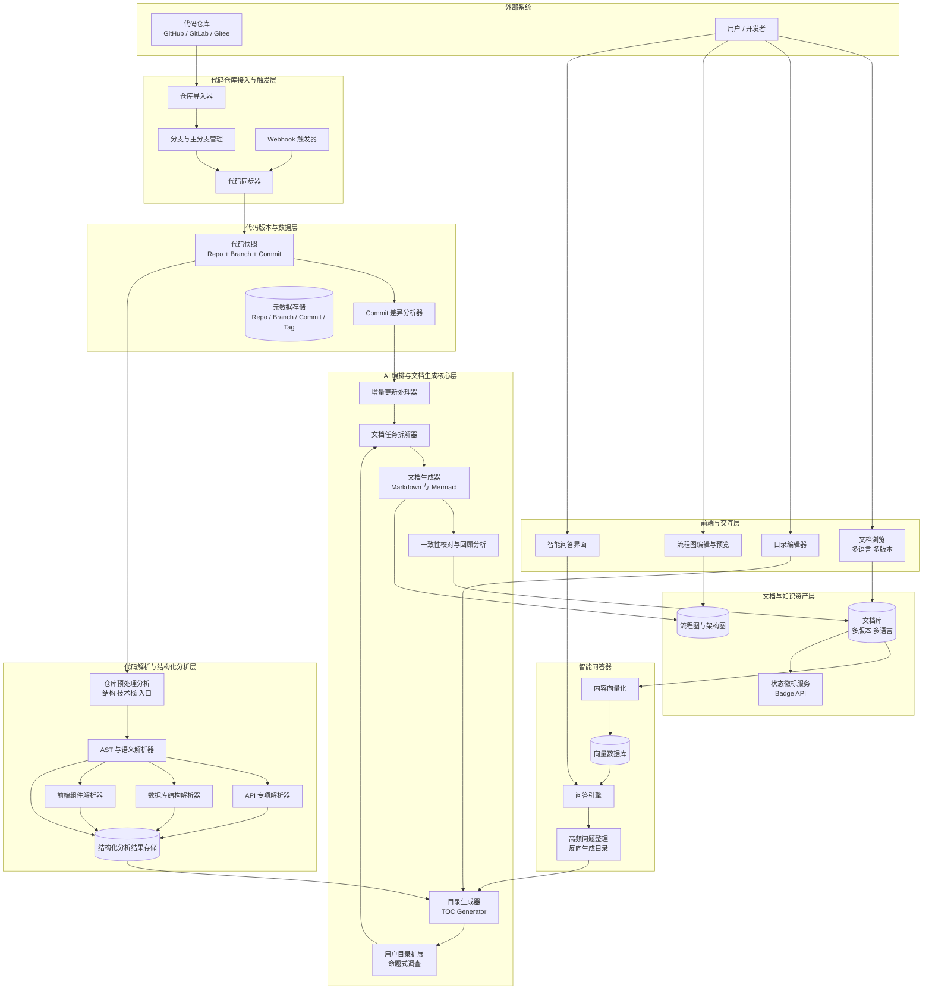

# openDeepWiki

[English](./README_EN.md) | 简体中文

## 项目简介

openDeepWiki 是一个基于 AI 的代码仓库智能解读平台，能够自动分析任意 GitHub 代码仓库，并生成结构化的项目文档。通过结合静态代码分析和大语言模型（LLM），帮助开发者快速理解开源项目的架构、API 和业务流程。

## 🌟 在线体验

[https://opendeepwiki.fly.dev/](https://opendeepwiki.fly.dev/)

无需安装配置，立即体验 openDeepWiki 的强大功能！

## ✨ 功能特性亮点

### 🎯 核心功能

#### 1. 智能文档生成系统
- **多 Agent 协作架构**：基于 Eino ADK 框架的多角色智能体系统，支持目录制定、文档生成、校验等全流程协作
- **任务编排器与状态机**：引入任务编排器和状态机，实现任务的可靠调度、依赖管理和状态流转
- **任务依赖与重试机制**：支持 RunAfter 任务依赖检查，自动重试失败任务，支持批量重试和强制重置
- **任务用量监控**：实时记录和显示 Token 用量、任务执行耗时，提供透明的资源使用情况
- **文档多版本管理**：支持文档多版本保存，可查看历史版本并对比差异
- **事件总线系统**：支持任务事件发布与订阅，实现系统各组件间的松耦合通信

#### 2. 高级文档导出
- **PDF 导出功能**：
  - 支持完整文档导出为 PDF，保留原有格式和样式
  - 智能目录书签生成，支持层级嵌套和点击跳转
  - 表格优化渲染，支持紧凑布局和中文适配
  - 代码块中文支持，解决乱码问题
  - 字体回退机制，确保在不同环境下正常显示

#### 3. 智能代码分析
- **API 接口分析**：自动识别和解析 API 接口，生成接口文档
- **数据库模型解析**：分析数据库结构，生成数据模型文档
- **前端组件解析**：识别前端组件，生成组件使用文档
- **AST 与语义解析**：深度分析代码结构，提取核心逻辑
- **目录提纲输出**：自动生成结构化文档目录，支持自定义调整

#### 4. 多模型支持与智能切换
- **API Key 管理**：支持多个 API Key 配置，优先级管理和禁用控制
- **模型自动切换**：运行时动态切换模型，支持限流检测和自动降级
- **模型池代理**：统一管理多个模型，提供负载均衡和故障转移
- **智能兜底策略**：模型调用失败时自动切换到备用模型，提高稳定性

#### 5. 数据同步与备份
- **数据同步功能**：支持仓库数据双向同步，可按文档筛选同步任务
- **同步历史记录**：记录所有同步操作，支持查看历史和回滚
- **对端地址管理**：管理同步对端地址，支持添加、编辑和删除
- **清空目标数据**：支持一键清空目标服务器数据
- **TaskUsage 同步**：同步任务用量数据，实现分布式环境下的资源统计

### 🔧 技术特性

#### 6. 系统架构优化
- **分层架构设计**：
  - 领域层（Domain）：核心业务逻辑和领域模型
  - 服务层（Service）：业务服务和编排逻辑
  - 数据层（Repository）：数据访问和持久化
  - 处理器层（Handler）：HTTP 请求处理和响应
- **事件驱动架构**：基于事件总线实现系统解耦和异步处理
- **配置驱动 Agent**：基于 YAML 配置的 Agent 管理，支持热加载
- **模块化设计**：按功能模块拆分代码，提高可维护性

#### 7. 开发与运维支持
- **全局任务监控**：实时查看所有仓库的任务执行状态和进度
- **智能模板分配**：根据仓库类型自动选择合适的文档模板
- **仓库分支管理**：支持多分支管理，自动识别主分支
- **任务统计显示**：统计任务成功、失败、排队等状态数量
- **文档评分系统**：对生成的文档进行质量评分，提供改进建议

#### 8. 用户体验增强
- **响应式设计**：支持移动端和桌面端，自适应不同屏幕尺寸
- **主题切换**：支持亮色和暗色主题，满足不同环境需求
- **国际化支持**：支持中英文切换，可扩展多语言
- **文档概览页面**：快速查看仓库所有文档概览和任务状态
- **仓库信息展示**：显示仓库分支、大小、提交信息等元数据

#### 9. 开发工具与规范
- **严格的开发规范**：
  - 后端开发规范：分层架构、错误处理、测试规范等
  - 前端开发规范：组件编写、状态管理、样式规范等
  - 文档编写规范：需求文档、设计文档、测试文档等
- **AI 协作开发约定**：定义 AI 参与代码编写的完整协作流程
- **代码质量保证**：
  - 单元测试覆盖核心功能
  - 集成测试验证端到端流程
  - 代码审查清单确保代码质量
- **文档驱动开发**：先写设计文档，再写代码，确保思路清晰

#### 10. 部署与扩展
- **Docker 支持**：提供完整的 Dockerfile 和 Docker Compose 配置
- **多平台构建**：支持 Linux、macOS、Windows 等多平台编译
- **Fly.io 部署**：提供一键部署到 Fly.io 的配置
- **静态链接二进制**：生成无依赖的可执行文件，便于部署
- **热重载开发**：使用 Air 实现开发时自动重载，提高开发效率


#### 11. PDF 导出增强
- 书签层级管理，支持多级目录结构
- 自动链接生成，点击目录跳转到对应章节
- 表格样式优化，支持紧凑布局和无间隙渲染
- 代码块中文适配，解决中文字符乱码问题
- 字体支持与回退机制，确保跨平台兼容性

#### 12. 任务管理优化
- 任务事件总线，支持任务生命周期事件的发布和订阅
- 任务依赖检查，防止任务执行顺序错误
- Pending 任务自动入队，定期处理待处理任务
- 任务重试机制，失败任务自动重试
- 批量重试所有报错任务，提高任务执行效率

#### 13. Agent 系统增强
- Agent 配置文件驱动，支持热加载和动态更新
- 模型列表支持，一个 Agent 可配置多个模型
- 终端命令执行工具，扩展 Agent 能力
- Markdown 校验代理，检查文档格式和语法
- 目录提纲输出，生成结构化文档目录

#### 14. 文档管理改进
- 文档多版本保存，支持查看历史版本
- 文档评分系统，评估文档质量
- 文档元数据展示，显示创建时间和更新时间
- 文档列表优化，显示最后更新时间
- 文档概览页面，快速查看所有文档

#### 15. 仓库管理增强
- 仓库分支管理，支持多分支切换
- 仓库元数据记录，记录仓库大小、分支和提交信息
- 仓库 URL 规范化，支持多种格式
- 仓库删除优化，支持仅删除本地目录
- 仓库重新下载，快速更新仓库内容

#### 16. UI/UX 优化
- 响应式布局改进，支持移动端和桌面端
- 任务监控界面，实时查看任务执行状态
- 仓库信息展示，显示仓库分支和大小
- 任务统计显示，统计任务状态分布
- 任务列表优化，显示任务类型和写入器

---

## 技术栈

### 后端
- **语言**：Go 1.24+
- **框架**：Gin
- **数据库**：SQLite（默认）/ MySQL
- **ORM**：GORM
- **日志**：klog
- **开发工具**：Air（热重载）

### 前端
- **框架**：React 19 + TypeScript
- **构建工具**：Vite
- **UI 组件**：Ant Design 6
- **Markdown 渲染**：react-markdown / react-md-editor
- **路由**：React Router 7

### AI 集成
- 支持 OpenAI 兼容接口
- 可配置 API 地址、模型和 Token
- 支持通过环境变量配置

## 快速开始

### 环境要求

- Go 1.24+
- Node.js 18+
- Git

### 安装步骤

```bash
# 1. 克隆项目
git clone https://github.com/weibaohui/openDeepWiki.git
cd openDeepWiki

# 2. 安装依赖
make setup

# 3. 初始化配置
make init-config

# 4. 编辑配置文件，设置 LLM API Key
vim backend/config.yaml
# 或设置环境变量
export OPENAI_API_KEY="your-api-key"
export OPENAI_BASE_URL="https://api.openai.com/v1"
export OPENAI_MODEL_NAME="gpt-4o"
```

### 启动服务

```bash
# 开发模式（推荐）：同时启动前后端，支持热重载
make dev

# 或分别启动
make air           # 后端（带热重载）
make run-frontend  # 前端

# 生产模式
make build
make run-backend
```

### 访问地址

- 前端页面：http://localhost:5173
- 后端 API：http://localhost:8080

## 使用指南

### 1. 配置 LLM

首次使用需要配置 LLM API：

**方式一：通过配置文件**

编辑 `backend/config.yaml`：

```yaml
llm:
  api_url: "https://api.openai.com/v1"
  api_key: "your-api-key"
  model: "gpt-4o"
  max_tokens: 4096
```

**方式二：通过环境变量（推荐）**

```bash
export OPENAI_API_KEY="your-api-key"
export OPENAI_BASE_URL="https://api.openai.com/v1"
export OPENAI_MODEL_NAME="gpt-4o"
```

**方式三：通过前端界面**

访问 `http://localhost:5173/config` 进行配置。

### 2. 解读代码仓库

1. 在首页输入 GitHub 仓库 URL（支持 https 和 git@ 格式）
2. 点击「添加」，系统自动克隆仓库
3. 克隆完成后，点击「执行所有任务」开始分析
4. 等待任务执行完成（5 个任务：概览、架构、接口、业务流程、部署）
5. 点击「查看文档」阅读生成的结果

### 3. 文档管理

- **在线阅读**：左侧导航树，右侧 Markdown 渲染
- **在线编辑**：点击「编辑」按钮修改文档内容
- **导出文档**：支持单个文档或整体打包导出
 

## 系统架构

```mermaid
flowchart TB

    %% 外部系统
    subgraph EXT[外部系统]
        GitRepo[代码仓库\nGitHub / GitLab / Gitee]
        User[用户 / 开发者]
    end

    %% 代码接入与触发层
    subgraph L1[代码仓库接入与触发层]
        Importer[仓库导入器]
        BranchMgr[分支与主分支管理]
        Webhook[Webhook 触发器]
        Syncer[代码同步器]
    end

    %% 版本与数据层
    subgraph L2[代码版本与数据层]
        CodeSnapshot[代码快照\nRepo + Branch + Commit]
        DiffAnalyzer[Commit 差异分析器]
        MetaDB[(元数据存储\nRepo / Branch / Commit / Tag)]
    end

    %% 代码理解层
    subgraph L3[代码解析与结构化分析层]
        RepoScanner[仓库预处理分析\n结构 技术栈 入口]
        ASTParser[AST 与语义解析器]
        APIParser[API 专项解析器]
        DBParser[数据库结构解析器]
        FEParser[前端组件解析器]
        StructStore[(结构化分析结果存储)]
    end

    %% AI 编排与生成核心层
    subgraph L4[AI 编排与文档生成核心层]
        TOCGen[目录生成器\nTOC Generator]
        UserTOCExt[用户目录扩展\n命题式调查]
        TaskPlanner[文档任务拆解器]
        DocWriter[文档生成器\nMarkdown 与 Mermaid]
        Reviewer[一致性校对与回顾分析]
        Incremental[增量更新处理器]
    end

    %% 文档与知识资产层
    subgraph L5[文档与知识资产层]
        DocStore[(文档库\n多版本 多语言)]
        MermaidStore[(流程图与架构图)]
        BadgeSvc[状态徽标服务\nBadge API]
    end

    %% 智能问答器
    subgraph L6[智能问答器]
        Embedding[内容向量化]
        VectorDB[(向量数据库)]
        QAChat[问答引擎]
        FAQGen[高频问题整理\n反向生成目录]
    end

    %% 前端交互层
    subgraph L7[前端与交互层]
        DocUI[文档浏览\n多语言 多版本]
        TOCEditor[目录编辑器]
        MermaidUI[流程图编辑与预览]
        ChatUI[智能问答界面]
    end

    %% 数据流关系
    GitRepo --> Importer
    Importer --> BranchMgr
    BranchMgr --> Syncer
    Webhook --> Syncer

    Syncer --> CodeSnapshot
    CodeSnapshot --> DiffAnalyzer
    CodeSnapshot --> RepoScanner

    RepoScanner --> ASTParser
    ASTParser --> APIParser
    ASTParser --> DBParser
    ASTParser --> FEParser

    ASTParser --> StructStore
    APIParser --> StructStore
    DBParser --> StructStore
    FEParser --> StructStore

    StructStore --> TOCGen
    TOCGen --> UserTOCExt
    UserTOCExt --> TaskPlanner
    TaskPlanner --> DocWriter
    DocWriter --> Reviewer
    Reviewer --> DocStore
    DocWriter --> MermaidStore

    DiffAnalyzer --> Incremental
    Incremental --> TaskPlanner

    DocStore --> Embedding
    Embedding --> VectorDB
    VectorDB --> QAChat
    QAChat --> FAQGen
    FAQGen --> TOCGen

    DocStore --> BadgeSvc

    %% 前端连接
    User --> DocUI
    User --> TOCEditor
    User --> MermaidUI
    User --> ChatUI

    DocUI --> DocStore
    TOCEditor --> TOCGen
    MermaidUI --> MermaidStore
    ChatUI --> QAChat

```


## 开发规范

项目遵循严格的开发规范，详见：

- [后端开发规范](./doc/开发规范/后端规范/)
- [前端开发规范](./doc/开发规范/前端规范/)

## 许可证

[MIT License](./LICENSE)

## 贡献

欢迎提交 Issue 和 Pull Request！

## 联系方式

如有问题或建议，请提交 Issue。
