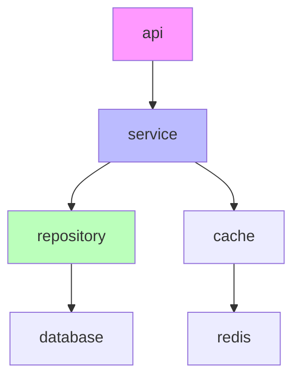

# Dependency Mapping Skill

分析并映射代码模块间的依赖关系。

## 使用场景

- 理解模块间的耦合关系
- 识别核心模块和辅助模块
- 检测架构问题（如循环依赖）
- 为文档生成模块关系图

## 功能能力

### 1. build_dependency_graph

构建模块依赖图。

**输入：**
```yaml
repo_path: string
language: string  # 主要编程语言
analysis_depth: "module" | "package" | "file"  # 默认 "module"
```

**输出：**
```yaml
dependency_graph:
  nodes:
    - id: "api"
      type: "module"
      path: "internal/api"
      size: 1500  # 代码行数
      
    - id: "service"
      type: "module"
      path: "internal/service"
      size: 3000
      
    - id: "repository"
      type: "module"
      path: "internal/repository"
      size: 2000
      
  edges:
    - source: "api"
      target: "service"
      type: "import"
      strength: 0.8  # 依赖强度
      
    - source: "service"
      target: "repository"
      type: "import"
      strength: 0.9
```

### 2. identify_core_modules

识别核心模块 vs 辅助模块。

**算法：**
1. 计算每个模块的入度（被依赖次数）
2. 计算每个模块的出度（依赖其他次数）
3. 使用 PageRank 或中心性算法计算重要性

**输出：**
```yaml
core_modules:
  - id: "service"
    importance_score: 0.95
    reason: "被 5 个模块依赖，包含核心业务逻辑"
    
  - id: "domain"
    importance_score: 0.88
    reason: "被 8 个模块依赖，定义领域模型"

auxiliary_modules:
  - id: "utils"
    importance_score: 0.3
    reason: "工具函数集合，被广泛使用但无核心业务逻辑"
    
  - id: "middleware"
    importance_score: 0.4
    reason: "HTTP 中间件，辅助功能"
```

### 3. detect_circular_dependencies

检测循环依赖。

**输出：**
```yaml
circular_dependencies:
  - cycle:
      - "moduleA"
      - "moduleB"
      - "moduleC"
      - "moduleA"
    severity: "high"
    suggestion: "考虑将共同依赖提取到新模块"
    
  - cycle:
      - "utils"
      - "helpers"
      - "utils"
    severity: "low"
    suggestion: "合并两个工具模块"
```

### 4. analyze_import_patterns

分析导入模式。

**输出：**
```yaml
import_patterns:
  external:
    - name: "github.com/gin-gonic/gin"
      usage_count: 15
      used_by:
        - "internal/api"
        - "cmd/server"
      
    - name: "github.com/redis/go-redis"
      usage_count: 3
      used_by:
        - "internal/cache"
        
  internal:
    - from: "internal/api"
      to: "internal/service"
      count: 25
      
    - from: "internal/service"
      to: "internal/repository"
      count: 18
```

## 完整输出格式

```yaml
DependencyAnalysis:
  dependency_graph:
    nodes: array
    edges: array
  core_modules: array
  auxiliary_modules: array
  circular_dependencies: array
  import_patterns:
    external: array
    internal: array
  stability_metrics:
    average_fan_in: 2.5
    average_fan_out: 3.2
    instability: 0.56
```

## 依赖分析方法

### Go 项目

1. 解析 `go.mod` 获取外部依赖
2. 分析 `import` 语句获取内部依赖
3. 支持模块级和包级分析

### Python 项目

1. 解析 `requirements.txt` / `pyproject.toml` 获取外部依赖
2. 分析 `import` / `from ... import` 语句
3. 识别相对导入和绝对导入

### JavaScript/TypeScript 项目

1. 解析 `package.json` 获取外部依赖
2. 分析 `import` / `require` 语句
3. 支持路径别名解析

## 可视化输出

可生成 Mermaid 图：



## 使用示例

```yaml
# 在 ArchitectAgent 中使用
skills:
  - dependency-mapping

task:
  name: 分析模块依赖
  steps:
    - action: dependency-mapping.analyze
      input:
        repo_path: "/tmp/repo"
        language: "go"
        analysis_depth: "module"
      output: dependency_analysis
```

## 依赖

- filesystem.read
- code.parse_ast
- code.get_call_graph

## 最佳实践

1. 对大型仓库，优先进行模块级分析
2. 关注核心模块，它们是文档的重点
3. 标记循环依赖为架构债务
4. 将依赖图用于生成架构文档
