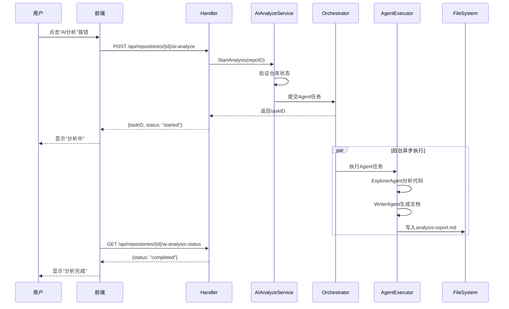

# 008-AI分析按钮-设计

# 0. 文件修改记录表

| 修改人 | 修改时间 | 修改内容 |
| ------ | -------- | -------- |
| AI | 2026-02-06 | 需求取消，标记设计废弃 |

## 设计状态

本设计对应的 AI 分析按钮需求已取消，设计文档保留用于历史追溯，相关实现与接口将移除。

## 1. 架构设计

### 1.1 整体流程

```
┌─────────────┐     ┌─────────────┐     ┌─────────────────┐
│   前端用户   │────▶│  AI分析按钮  │────▶│ 后端API        │
│  点击按钮   │     │             │     │ POST /ai-analyze│
└─────────────┘     └─────────────┘     └────────┬────────┘
                                                  │
                                                  ▼
┌─────────────────────────────────────────────────────────────────┐
│                        Agent执行层                                │
│  ┌─────────────┐    ┌─────────────┐    ┌─────────────────────┐  │
│  │ExplorerAgent│───▶│ Code Analysis│───▶│ TitleContext        │  │
│  │  代码探索   │    │  代码分析    │    │ 分析上下文          │  │
│  └─────────────┘    └─────────────┘    └──────────┬──────────┘  │
│                                                   │              │
│  ┌─────────────┐    ┌─────────────┐              │              │
│  │ WriterAgent │◀───│  Doc Gen    │◀─────────────┘              │
│  │  文档生成   │    │  文档生成   │                               │
│  └──────┬──────┘    └─────────────┘                               │
│         │                                                         │
│  ┌──────▼──────┐                                                  │
│  │ WriteToFile │────────▶ {repo}/.opendeepwiki/analysis-report.md │
│  │  保存文档   │                                                  │
│  └─────────────┘                                                  │
└─────────────────────────────────────────────────────────────────┘
```

### 1.2 时序图



## 2. API设计

### 2.1 启动AI分析

```yaml
POST /api/repositories/{id}/ai-analyze

Request:
  body: {}

Response (200 OK):
  {
    "task_id": "uuid-string",
    "status": "started",
    "message": "AI analysis started"
  }

Response (400 Bad Request):
  {
    "error": "Repository status not ready"
  }

Response (409 Conflict):
  {
    "error": "Analysis already in progress"
  }
```

### 2.2 查询分析状态

```yaml
GET /api/repositories/{id}/ai-analysis-status

Response (200 OK):
  {
    "task_id": "uuid-string",
    "status": "running|completed|failed",
    "progress": 0-100,
    "output_path": "/path/to/repo/.opendeepwiki/analysis-report.md",
    "error_msg": "",
    "created_at": "2026-01-30T10:00:00Z",
    "completed_at": "2026-01-30T10:05:00Z"
  }
```

## 3. 后端设计

### 3.1 新增Model

```go
// AIAnalysisTask AI分析任务
type AIAnalysisTask struct {
    ID           uint       `json:"id" gorm:"primaryKey"`
    RepositoryID uint       `json:"repository_id" gorm:"index;not null"`
    TaskID       string     `json:"task_id" gorm:"size:64;uniqueIndex"` // UUID
    Status       string     `json:"status" gorm:"size:50;default:pending"` // pending, running, completed, failed
    Progress     int        `json:"progress" gorm:"default:0"` // 0-100
    OutputPath   string     `json:"output_path" gorm:"size:500"`
    ErrorMsg     string     `json:"error_msg" gorm:"size:2000"`
    CreatedAt    time.Time  `json:"created_at"`
    UpdatedAt    time.Time  `json:"updated_at"`
    CompletedAt  *time.Time `json:"completed_at"`
}
```

### 3.2 新增Handler

```go
// AIAnalyzeHandler 处理AI分析相关请求
type AIAnalyzeHandler struct {
    service *service.AIAnalyzeService
}

// StartAnalysis 启动AI分析
func (h *AIAnalyzeHandler) StartAnalysis(c *gin.Context)

// GetAnalysisStatus 获取分析状态
func (h *AIAnalyzeHandler) GetAnalysisStatus(c *gin.Context)
```

### 3.3 新增Service

```go
// AIAnalyzeService AI分析服务
type AIAnalyzeService struct {
    cfg          *config.Config
    repoRepo     repository.RepoRepository
    taskRepo     repository.AIAnalysisTaskRepository
    orchestrator *orchestrator.Orchestrator
}

// StartAnalysis 启动AI分析流程
func (s *AIAnalyzeService) StartAnalysis(repoID uint) (*model.AIAnalysisTask, error)

// GetAnalysisStatus 获取分析状态
func (s *AIAnalyzeService) GetAnalysisStatus(repoID uint) (*model.AIAnalysisTask, error)

// executeAnalysis 执行Agent分析（异步）
func (s *AIAnalyzeService) executeAnalysis(task *model.AIAnalysisTask, repo *model.Repository)
```

### 3.4 Agent执行器

```go
// AgentExecutor Agent执行器
type AgentExecutor struct {
    cfg      *config.Config
    llmClient *llm.Client
}

// Execute 执行Agent分析流程
func (e *AgentExecutor) Execute(ctx context.Context, repoPath string, outputPath string) error

// exploreCode 使用ExplorerAgent探索代码
func (e *AgentExecutor) exploreCode(ctx context.Context, repoPath string) (*CodeAnalysisResult, error)

// generateDoc 使用WriterAgent生成文档
func (e *AgentExecutor) generateDoc(ctx context.Context, analysis *CodeAnalysisResult) (string, error)
```

## 4. 前端设计

### 4.1 组件修改

修改 `Home.tsx` 中的仓库卡片，添加AI分析按钮：

```tsx
// 在Card actions中添加
<Button
    type="text"
    icon={<RobotOutlined />}
    onClick={(e) => handleAIAnalyze(repo.id, e)}
    disabled={repo.status !== 'ready' && repo.status !== 'completed'}
    loading={aiAnalyzeStatus[repo.id]?.status === 'running'}
>
    {t('repository.ai_analyze')}
</Button>
```

### 4.2 新增API调用

```ts
// api.ts
export const aiAnalyzeApi = {
    start: (repoId: number) => api.post<{ task_id: string; status: string }>(`/repositories/${repoId}/ai-analyze`),
    getStatus: (repoId: number) => api.get<AIAnalysisStatus>(`/repositories/${repoId}/ai-analysis-status`),
};
```

### 4.3 新增类型定义

```ts
// types/index.ts
export interface AIAnalysisStatus {
    task_id: string;
    status: 'pending' | 'running' | 'completed' | 'failed';
    progress: number;
    output_path: string;
    error_msg: string;
    created_at: string;
    completed_at: string | null;
}
```

## 5. 文档生成格式

### 5.1 输出文档结构

```markdown
# AI 代码分析报告

> 生成时间: 2026-01-30 10:00:00
> 分析仓库: {repo_name}
> 分析分支: main

## 1. 项目概述

### 1.1 项目类型
{detected_project_type}

### 1.2 技术栈
- 主要语言: {primary_language}
- 框架: {framework}

### 1.3 目录结构
```
{tree_structure}
```

## 2. 核心模块分析

### 2.1 {模块1}
**文件位置**: `{file_path}`

**功能说明**:
{function_description}

**关键代码**:
```{language}
{code_snippet}
```

### 2.2 {模块2}
...

## 3. 关键函数/方法分析

### 3.1 {函数名}
**位置**: `{file_path}:{line_number}`

**功能**: 
{function_description}

**调用关系**:
```mermaid
callGraph
    {graph_content}
```

## 4. 数据流分析

### 4.1 主要数据流
{mermaid_flowchart}

## 5. 总结与建议

{summary_content}
```

## 6. 目录结构

### 6.1 后端新增文件

```
backend/internal/
├── handler/
│   └── ai_analyze.go              # AI分析Handler
├── service/
│   ├── ai_analyze.go              # AI分析Service
│   └── agent/
│       └── executor.go            # Agent执行器
├── model/
│   └── models.go                  # 新增AIAnalysisTask模型
└── repository/
    └── ai_analysis_task_repo.go   # AI分析任务Repository
```

### 6.2 前端修改文件

```
frontend/src/
├── pages/
│   └── Home.tsx                   # 添加AI分析按钮
├── services/
│   └── api.ts                     # 新增AI分析API
└── types/
    └── index.ts                   # 新增AI分析类型
```

## 7. 状态流转

```
[pending] ──▶ [running] ──▶ [completed]
                 │
                 ▼
              [failed]
```

- **pending**: 任务已创建，等待执行
- **running**: Agent正在执行分析
- **completed**: 分析完成，文档已生成
- **failed**: 分析失败，error_msg记录原因

## 8. 错误处理

| 错误场景 | 处理方式 |
|---------|---------|
| 仓库状态不允许 | 返回400，提示"仓库未就绪" |
| 分析任务已存在 | 返回409，返回现有任务ID |
| Agent执行失败 | 状态设为failed，记录错误详情 |
| 文件写入失败 | 状态设为failed，记录IO错误 |
| 超时(10分钟) | 状态设为failed，记录超时错误 |

## 9. 安全考虑

1. 仅允许对`ready`或`completed`状态的仓库进行分析
2. 文件写入限制在仓库目录下的`.opendeepwiki/`子目录
3. Agent执行超时限制（10分钟）
4. 并发控制：同一仓库同一时间只能有一个分析任务
