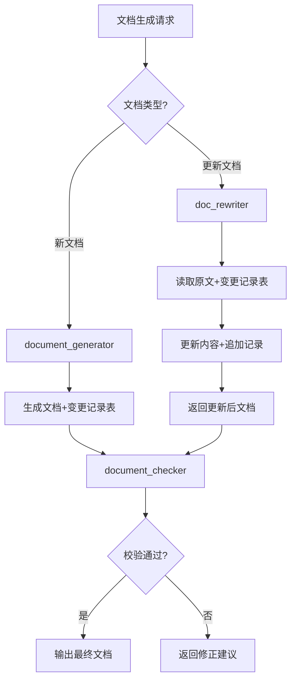
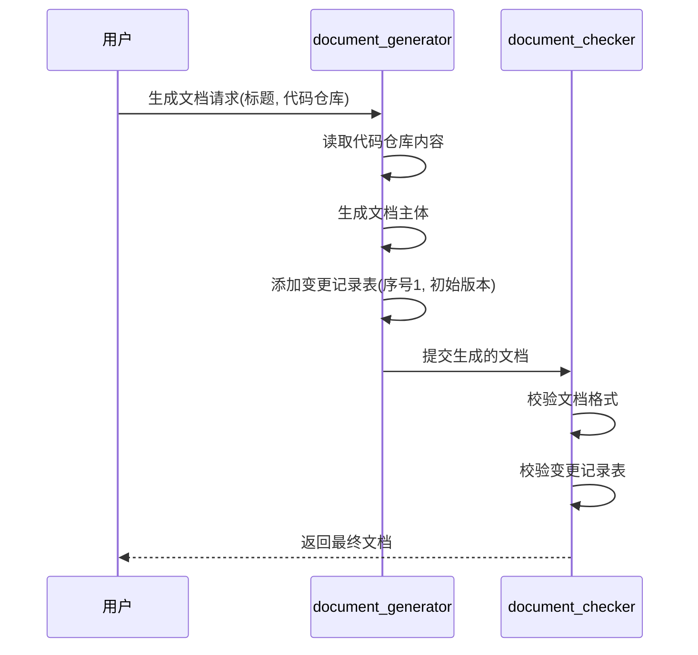
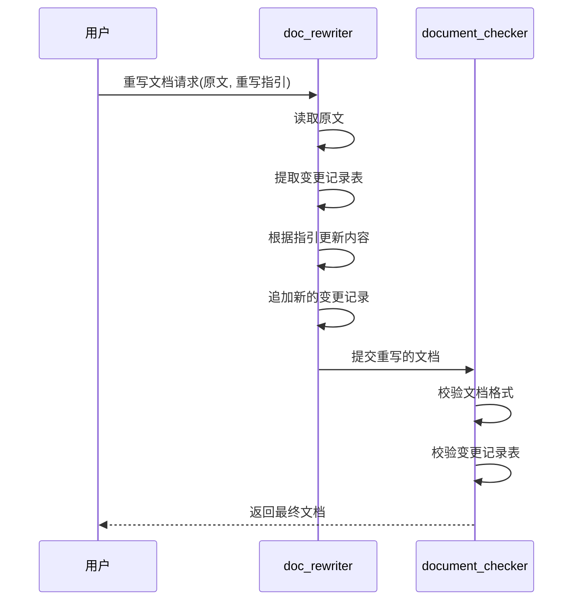

# 054-文档变更记录表-设计.md

# 1. 背景与目标

## 1.1 背景

根据需求文档（054-文档变更记录表-需求.md），需要在所有AI生成的文档中添加统一的变更记录表，用于追踪文档的变更历史。

## 1.2 目标

本设计文档详细说明如何通过更新智能体的提示词来实现文档变更记录表功能。

# 2. 总体设计

## 2.1 设计思路

通过更新backend/agents/目录下相关智能体的yaml配置文件，在instruction字段中添加关于变更记录表的要求和规范，确保AI生成的所有文档都包含统一的变更记录表。

## 2.2 架构



## 2.3 核心流程

### 文档生成流程



### 文档重写流程



# 3. 详细设计

## 3.1 变更记录表格式定义

### 标准格式

```markdown
# 文件修改记录表

| 序号 | 修改人 | 修改时间 | 主要修改内容 |
| ---- | ------ | -------- | ------------ |
| 1 | AI | 2026-02-18 | 初始版本 |
```

### 格式说明

| 元素 | 规范 | 说明 |
| ---- | ---- | ---- |
| 章节标题 | `# 文件修改记录表` | H1级别，放在文档最后 |
| 序号 | 数字，从1开始 | 连续递增 |
| 修改人 | 字符串 | AI 或用户名 |
| 修改时间 | YYYY-MM-DD | 日期格式 |
| 主要修改内容 | 文本 | 简明扼要描述修改内容 |

## 3.2 智能体更新设计

### 3.2.1 document_generator.yaml

**更新内容：**

1. 在instruction中添加变更记录表要求
2. 定义生成新文档时的初始记录格式
3. 确保变更记录表位于文档开头

**新增提示词片段：**

```yaml
instruction: |
  ...
  七、变更记录表要求（强制）
  --------------------------------------------------

  所有生成的文档必须包含变更记录表，格式如下：

  ```markdown
  # 0. 文件修改记录表

  | 序号 | 修改人 | 修改时间 | 主要修改内容 |
  | ---- | ------ | -------- | ------------ |
  | 1 | AI | {当前日期} | 初始版本 |
  ```

  要求：
  - 变更记录表必须位于文档最前面（H1标题之后）
  - 序号从1开始
  - 修改人填写"AI"
  - 修改时间使用当前日期（YYYY-MM-DD格式）
  - 主要修改内容填写"初始版本"或简短描述
  --------------------------------------------------
```

### 3.2.2 doc_rewriter.yaml

**更新内容：**

1. 更新现有的"更新内容"表格要求
2. 要求读取原始文档的变更记录表
3. 要求在重写时追加新的变更记录
4. 确保序号正确递增

**修改后的提示词片段：**

```yaml
instruction: |
  ...
  五、变更记录表更新要求（强制）
  --------------------------------------------------

  在更新文档时，必须处理变更记录表：

  1. 读取原始文档中的变更记录表
  2. 确定当前最大序号
  3. 在表格末尾追加新的变更记录
  4. 新记录的序号为当前最大序号+1
  5. 修改人填写"AI"或根据实际情况填写
  6. 修改时间使用当前日期（YYYY-MM-DD格式）
  7. 主要修改内容根据本次重写内容填写

  新记录格式：
  | {序号} | AI | {当前日期} | {主要修改内容} |
  --------------------------------------------------
```

### 3.2.3 document_checker.yaml

**更新内容：**

1. 添加变更记录表的校验规则
2. 检查表格是否存在
3. 检查表格格式是否正确
4. 检查字段是否完整
5. 确保修改时间格式正确

**新增提示词片段：**

```yaml
instruction: |
  ...
  三、变更记录表校验（强制）
  --------------------------------------------------

  必须检查文档是否包含变更记录表：

  1. 检查是否存在"文件修改记录表"章节
  2. 检查表格格式是否正确（4列，正确对齐）
  3. 检查列标题是否正确（序号、修改人、修改时间、主要修改内容）
  4. 检查序号是否连续递增
  5. 检查修改时间格式是否为YYYY-MM-DD
  6. 如果缺失或格式错误，必须添加或修正
  --------------------------------------------------
```

### 3.2.4 其他相关智能体

**markdown_checker.yaml:**

- 确保变更记录表的Markdown格式正确
- 检查表格语法是否规范

**toc_checker.yaml:**

- 确保变更记录表在目录中正确显示
- 验证"文件修改记录表"章节被正确索引

**toc_editor.yaml:**

- 处理变更记录表时的目录更新
- 确保目录结构完整

**incremental_checker.yaml:**

- 检查增量更新时的变更记录表
- 确保增量变更被正确记录

**incremental_editor.yaml:**

- 处理增量编辑时的变更记录表更新
- 确保增量变更记录格式正确

## 3.3 数据结构

### 变更记录项

```typescript
interface ChangeRecord {
    id: number;           // 序号
    modifier: string;     // 修改人
    date: string;         // 修改时间 YYYY-MM-DD
    content: string;      // 主要修改内容
}
```

### 变更记录表

```typescript
interface ChangeRecordTable {
    title: string;        // "文件修改记录表"
    headers: string[];    // ["序号", "修改人", "修改时间", "主要修改内容"]
    records: ChangeRecord[];
}
```

# 4. 实现方案

## 4.1 实施步骤

1. **更新 document_generator.yaml**
   - 在instruction中添加变更记录表要求
   - 定义初始记录格式
   - 指定表格位置

2. **更新 doc_rewriter.yaml**
   - 修改现有的表格要求
   - 添加变更记录表处理逻辑
   - 确保序号递增

3. **更新 document_checker.yaml**
   - 添加变更记录表校验规则
   - 定义格式检查标准
   - 添加修正逻辑

4. **更新其他相关智能体**
   - markdown_checker.yaml
   - toc_checker.yaml
   - toc_editor.yaml
   - incremental_checker.yaml
   - incremental_editor.yaml

5. **测试验证**
   - 测试新文档生成
   - 测试文档重写
   - 测试文档校验
   - 验证格式正确性

## 4.2 代码结构

```
backend/agents/
├── document_generator.yaml      [更新] 添加变更记录表要求
├── doc_rewriter.yaml            [更新] 更新变更记录表处理
├── document_checker.yaml        [更新] 添加变更记录表校验
├── markdown_checker.yaml        [更新] 检查表格格式
├── toc_checker.yaml            [更新] 检查目录包含
├── toc_editor.yaml             [更新] 处理目录更新
├── incremental_checker.yaml    [更新] 检查增量变更记录
└── incremental_editor.yaml     [更新] 处理增量记录更新
```

## 4.3 关键实现点

### 序号管理

- 读取变更记录表时解析所有序号
- 确定最大序号值
- 新记录序号 = 最大序号 + 1

### 格式校验

- 使用正则表达式验证日期格式：`^\d{4}-\d{2}-\d{2}$`
- 检查表格列数是否为4
- 检查列对齐方式是否正确

### 内容生成

- 主要修改内容要简明扼要
- 突出本次变更的核心点
- 避免过于冗长或过于简单

# 5. 异常处理

## 5.1 变更记录表缺失

- **检测方法**：查找"文件修改记录表"标题
- **处理方式**：添加默认的变更记录表，序号从1开始
- **提示信息**：提示文档缺少变更记录表，已添加

## 5.2 格式错误

- **检测方法**：检查表格列数、对齐方式、日期格式
- **处理方式**：自动修正格式错误
- **提示信息**：提示格式错误，已修正

## 5.3 序号不连续

- **检测方法**：检查序号序列是否连续
- **处理方式**：按最大序号+1继续
- **提示信息**：提示序号不连续，已处理

## 5.4 日期格式错误

- **检测方法**：正则表达式匹配
- **处理方式**：使用当前日期替换
- **提示信息**：提示日期格式错误，已修正

# 6. 测试设计

## 6.1 单元测试

### 变更记录表格式校验

- [ ] 测试标准格式通过
- [ ] 测试缺少标题失败
- [ ] 测试列数错误失败
- [ ] 测试日期格式错误失败

### 序号管理

- [ ] 测试从1开始
- [ ] 测试正确递增
- [ ] 测试不连续序列处理

## 6.2 集成测试

### 文档生成测试

- [ ] 生成新文档包含变更记录表
- [ ] 初始记录格式正确
- [ ] 位置正确

### 文档重写测试

- [ ] 重写时保留原有变更记录
- [ ] 新增记录序号正确
- [ ] 记录内容准确

### 文档校验测试

- [ ] 校验正确的变更记录表
- [ ] 修正错误的变更记录表
- [ ] 处理缺失的变更记录表

## 6.3 手动测试用例

| 用例 | 操作 | 预期结果 |
| ---- | ---- | -------- |
| 生成新文档 | 请求生成文档 | 包含变更记录表，序号从1开始 |
| 重写文档 | 请求重写文档 | 保留原记录，追加新记录，序号正确 |
| 校验文档 | 校验包含变更记录表的文档 | 通过校验，不修改 |
| 校验错误文档 | 校验格式错误的文档 | 自动修正格式 |
| 缺失记录表 | 校验缺少变更记录表的文档 | 自动添加默认记录表 |

# 7. 风险评估

## 7.1 风险列表

| 风险 | 影响 | 概率 | 应对措施 |
| ---- | ---- | ---- | -------- |
| 智能体理解错误 | 高 | 中 | 明确、详细的提示词设计 |
| 格式不一致 | 中 | 低 | 严格的格式校验 |
| 序号冲突 | 低 | 低 | AI场景暂不考虑协作 |
| 性能影响 | 低 | 低 | 轻量级处理，影响极小 |

## 7.2 风险缓解

- 提供详细的提示词和示例
- 实现严格的格式校验
- 添加错误处理和降级方案
- 充分的测试覆盖

# 8. 验收标准

## 8.1 功能验收

- [ ] 所有AI生成的文档包含变更记录表
- [ ] 变更记录表格式符合规范
- [ ] 文档重写时正确更新变更记录
- [ ] 文档校验时正确处理变更记录表

## 8.2 格式验收

- [ ] 表格标题正确
- [ ] 列标题正确
- [ ] 列对齐正确
- [ ] 日期格式正确

## 8.3 质量验收

- [ ] 序号连续递增
- [ ] 记录内容准确
- [ ] 无重复记录
- [ ] 位置正确

# 9. 后续优化

- 考虑支持更详细的时间格式（YYYY-MM-DD HH:MM:SS）
- 考虑添加额外的字段（影响范围、相关任务等）
- 考虑支持协作场景下的修改人管理
- 考虑实现变更记录的可视化展示

# 文件修改记录表

| 序号 | 修改人 | 修改时间 | 主要修改内容 |
| ---- | ------ | -------- | ------------ |
| 1 | AI | 2026-02-18 | 初始版本，定义文档变更记录表设计 |
| 2 | AI | 2026-02-18 | 调整变更记录表位置到文档最后，简化语言 |
| 3 | AI | 2026-02-18 | 修改文档编号从050改为054 |

