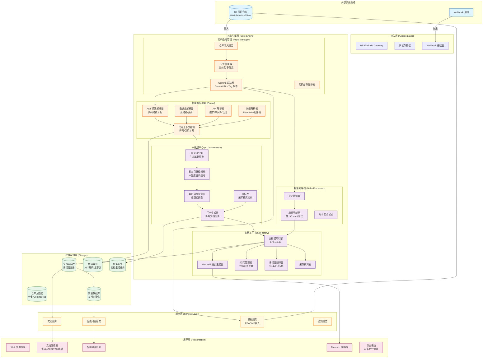
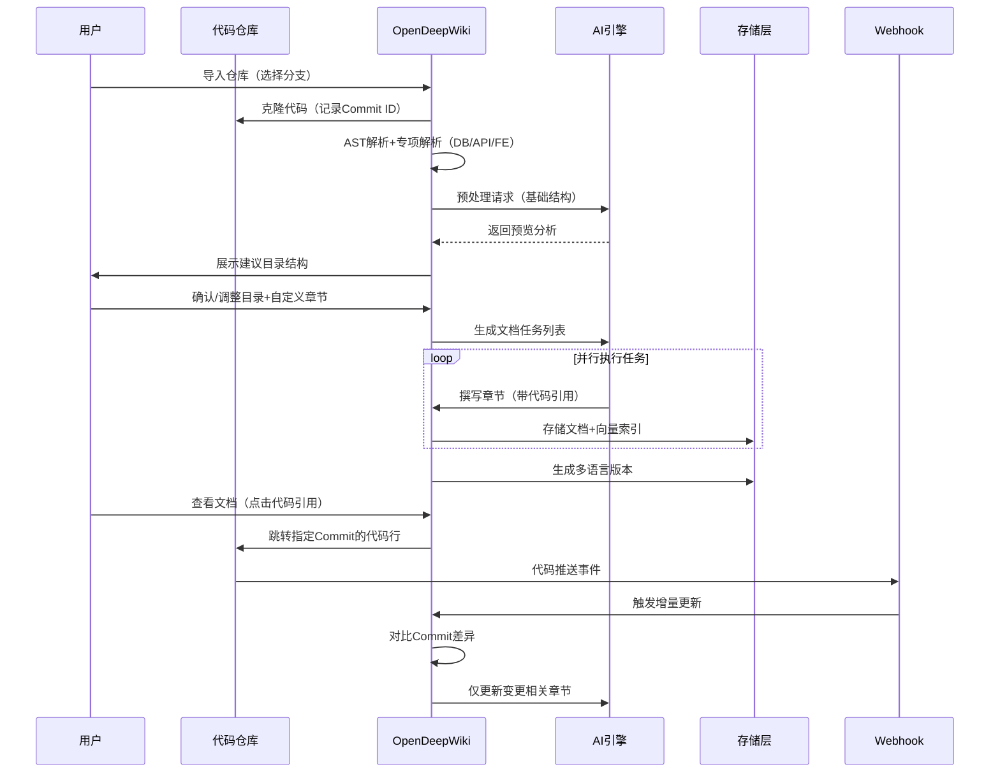

## 功能模块详细拆解

### 1. 代码仓库管理模块 (Repository Management)
| 子模块           | 核心功能                                            |
| ---------------- | --------------------------------------------------- |
| **多分支管理**   | 支持主分支/特性分支选择，明确文档生成基准分支       |
| **版本追踪**     | 记录 Commit ID、关联 Tag 版本号，确保文档版本可追溯 |
| **Webhook 触发** | 接收代码推送事件，自动触发文档更新流程              |
| **增量对比**     | 对比上次解析的 Commit，识别变更文件范围             |

### 2. 智能解析引擎 (Intelligent Parser)
| 解析器类型       | 功能描述                                         |
| ---------------- | ------------------------------------------------ |
| **AST 解析器**   | 代码语法树分析，提取函数、类、接口定义及调用关系 |
| **数据库解析器** | 识别表结构、主外键、字段类型、索引、注释         |
| **API 解析器**   | 提取接口路由、请求/响应格式、中间件链、认证要求  |
| **前端解析器**   | 分析 React/Vue 组件树、Props 传递、状态管理      |
| **上下文存储**   | 记录代码行号范围、文件路径，为后续引用提供坐标   |

### 3. AI 编排中心 (AI Orchestration)
**动态生成流程（替代固定模板）：**
```
预处理阶段 → AI 分析代码结构 → 生成建议目录 → 用户自定义补充 → 生成任务列表 → 执行撰写
```

| 组件           | 职责                                               |
| -------------- | -------------------------------------------------- |
| **预处理引擎** | 快速扫描生成基础预览（代码规模、技术栈、目录结构） |
| **动态规划器** | 基于预览信息，AI 决策文档应包含的章节体系          |
| **用户自定义** | 允许用户像"命题调查"一样添加关注维度               |
| **任务生成器** | 将目录拆解为可执行的文档编制任务                   |
| **模板库**     | 提供编写格式约束，防止 AI 过度发散                 |

### 4. 文档工厂 (Document Factory)
| 功能             | 说明                                                    |
| ---------------- | ------------------------------------------------------- |
| **Mermaid 图表** | 自动生成并支持编辑流程图、架构图、时序图                |
| **引用溯源**     | 大模型生成结论时标注来源代码行号，支持点击跳转          |
| **多语言翻译**   | 中文为基准，自动翻译为英/日/韩/俄等，按用户语言偏好展示 |
| **编辑校对**     | 对 AI 生成内容进行事实性校验和格式规范检查              |

### 5. 增量处理器 (Delta Processor)
- **变更检测**：对比新旧 Commit 差异
- **精准更新**：仅对变更涉及的文档章节进行增量重写
- **版本历史**：保留文档变更历史，支持版本对比

### 6. 智能问答器 (Q&A Bot)
| 功能模块         | 实现细节                            |
| ---------------- | ----------------------------------- |
| **向量化存储**   | 文档内容 Embedding 存入向量数据库   |
| **对话交互**     | 基于 RAG 的聊天框，支持上下文理解   |
| **高频问题挖掘** | 分析用户提问热点，自动生成 FAQ 章节 |
| **文档压缩**     | 提取仓库极简摘要作为大模型上下文    |

### 7. 徽标服务 (Badge Service)
三种嵌入形式供 README 使用：
1. **基础版**：纯图标超链接
2. **状态版**：显示文档解析状态（已完成/进行中）
3. **进度版**：显示落后主分支的 Commit 数量

### 8. 导出与扩展 (Export & Extension)
- 闪卡生成（便于记忆核心概念）
- PPT 大纲导出
- 自定义格式扩展接口

## 数据流转架构


  