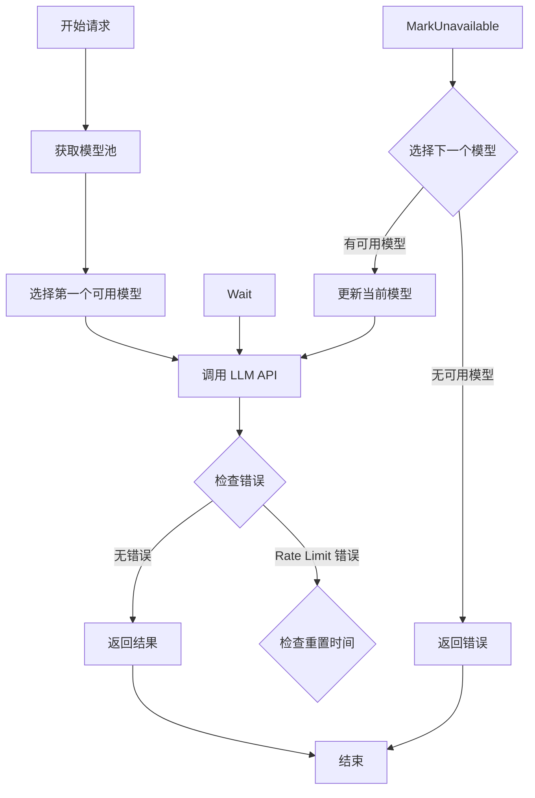

# 017-API Key管理与模型自动切换-需求.md

## 1. 背景（Why）

当前系统使用 LLM API 进行代码分析，但存在以下问题：

1. **单模型限制**：系统只能配置一个 LLM 模型（一个 API Key 对应 一个 Model，一个baseUrl）
2. **速率限制风险**：当遇到速率限制（Rate Limit）错误时，系统无法自动切换到其他模型
3. **资源浪费**：可能需要维护多个 API Key，但无法智能地分配使用
4. **可靠性不足**：单一模型故障会导致整个任务失败

因此，需要实现 API Key 管理和模型自动切换机制，提高系统的可靠性和资源利用率。

---

## 2. 目标（What，必须可验证）

- [ ] 创建 API Key 管理的数据库表，支持存储多个 API Key 配置
- [ ] 支持在 `agents/*.yaml` 中声明多个模型配置，不填使用默认，填写使用模型列表
- [ ] 实现模型自动切换机制，当检测到 Rate Limit 错误时自动切换到下一个可用模型
- [ ] 实现模型优先级和健康状态管理
- [ ] 记录模型切换日志，便于监控和排查问题
- [ ] 提供管理接口，支持 API Key 的增删改查操作

---

## 3. 非目标（Explicitly Out of Scope）

- [ ] 不实现模型负载均衡（基于响应时间的智能分配）
- [ ] 不实现模型成本统计与预算控制
- [ ] 不实现模型性能对比分析
- [ ] 不实现多租户隔离

---

## 4. 核心概念定义

### 4.1 API Key 配置

API Key 配置包含以下信息：
- **名称**：配置的唯一标识
- **Provider**：服务提供商（如 openai、anthropic、deepseek 等）
- **Base URL**：API 基础 URL
- **API Key**：认证密钥
- **Model**：使用的模型名称
- **优先级**：切换优先级（数字越小优先级越高）
- **状态**：启用/禁用/不可用
- **最后使用时间**：上次使用该配置的时间

### 4.2 模型池

模型池是针对特定 Agent 的模型配置集合，从数据库中的 API Key 配置中筛选和管理。每个 Agent 可以配置自己的模型池，或者使用默认模型池。

### 4.3 模型切换策略

当检测到错误时，按以下策略切换：
1. 检测到 Rate Limit 错误（HTTP 429 或错误消息包含 "rate limit"）
2. 标记当前模型为"不可用"，设置重置时间
3. 按优先级顺序选择下一个可用的模型
4. 重试请求
5. 如果所有模型都不可用，返回错误

---

## 5. 功能需求清单（Checklist）

### 5.1 数据库设计

- [ ] 创建 `api_keys` 表，存储 API Key 配置
- [ ] 支持字段：id, name, provider, base_url, api_key, model, priority, status, request_count, error_count, last_used_at, rate_limit_reset_at, created_at, updated_at

### 5.2 Agent 配置扩展

- [ ] 扩展 `agents/*.yaml` 配置，支持声明一个或多个模型
- [ ] 支持两种模式：
  - 单模型模式：`model: "gpt-4o"`（使用默认模型）
  - 多模型模式：`models: ["gpt-4o", "claude-3-opus", "deepseek-chat"]`（使用指定模型列表）
- [ ] 支持通过 API Key 配置的名称引用模型：`models: ["openai-primary", "anthropic-backup"]`

### 5.3 模型提供者接口扩展

- [ ] 扩展 `ModelProvider` 接口，支持模型池管理
- [ ] 实现 `GetModelPool(name string) []model.ToolCallingChatModel` 接口
- [ ] 实现模型切换逻辑
- [ ] 实现错误检测与模型标记逻辑

### 5.4 模型切换机制

- [ ] 检测 Rate Limit 错误：
  - HTTP 状态码 429
  - 错误消息包含 "rate limit"、"quota exceeded"、"too many requests"
- [ ] 标记模型为"不可用"，根据 API 响应设置重置时间
- [ ] 按优先级选择下一个可用模型
- [ ] 记录切换日志：`klog.Warningf("Model switch: %s -> %s, reason: %s", oldModel, newModel, reason)`
- [ ] 支持最多切换 N 次（默认 3 次）

### 5.5 API Key 管理接口

- [ ] 提供 API 接口：
  - `GET /api/api-keys` - 列出所有 API Key 配置
  - `POST /api/api-keys` - 创建新的 API Key 配置
  - `PUT /api/api-keys/:id` - 更新 API Key 配置
  - `DELETE /api/api-keys/:id` - 删除 API Key 配置
  - `PATCH /api/api-keys/:id/status` - 启用/禁用 API Key
- [ ] 敏感字段（API Key）在返回时需要脱敏

### 5.6 统计与监控

- [ ] 记录每个 API Key 的请求次数和错误次数
- [ ] 更新最后使用时间
- [ ] 提供统计接口：`GET /api/api-keys/stats`

---

## 6. 数据结构

### 6.1 数据库表结构

```sql
CREATE TABLE api_keys (
    id INTEGER PRIMARY KEY AUTOINCREMENT,
    name VARCHAR(255) UNIQUE NOT NULL,           -- 配置名称
    provider VARCHAR(50) NOT NULL,               -- 服务提供商（openai, anthropic, deepseek）
    base_url VARCHAR(500) NOT NULL,              -- API 基础 URL
    api_key TEXT NOT NULL,                       -- API Key
    model VARCHAR(255) NOT NULL,                 -- 模型名称
    priority INTEGER DEFAULT 0,                 -- 优先级（越小优先级越高）
    status VARCHAR(20) DEFAULT 'enabled',        -- 状态：enabled/disabled/unavailable
    last_used_at DATETIME,                       -- 最后使用时间
    rate_limit_reset_at DATETIME,               -- 速率限制重置时间
    created_at DATETIME DEFAULT CURRENT_TIMESTAMP,
    updated_at DATETIME DEFAULT CURRENT_TIMESTAMP,
    deleted_at DATETIME                          -- 软删除时间
);
 
```

### 6.2 Go 模型定义

```go
package model

import "time"

// APIKey API Key 配置
type APIKey struct {
    ID                 uint       `json:"id" gorm:"primaryKey"`
    Name               string     `json:"name" gorm:"size:255;uniqueIndex"`
    Provider           string     `json:"provider" gorm:"size:50;index"`
    BaseURL            string     `json:"base_url" gorm:"size:500"`
    APIKey             string     `json:"api_key" gorm:"type:text"`
    Model              string     `json:"model" gorm:"size:255"`
    Priority           int        `json:"priority" gorm:"default:0;index"`
    Status             string     `json:"status" gorm:"size:20;default:'enabled';index"` // enabled/disabled/unavailable
    LastUsedAt         *time.Time `json:"last_used_at"`
    CreatedAt          time.Time  `json:"created_at"`
    UpdatedAt          time.Time  `json:"updated_at"`
}

// TableName 指定表名
func (APIKey) TableName() string {
    return "api_keys"
}
```

### 6.3 Agent YAML 配置示例

```yaml
# agents/editor.yaml
name: Editor
description: 文档编辑 - 负责组装和优化最终文档


# 置空表示使用默认模型。填写代表使用多模型模式
models:
  - "openai-primary"      # 引用 API Key 配置名称
  - "anthropic-backup"
  - "deepseek-fallback"

instruction: |
  你是文档编辑 Editor。
  ...

tools: []
maxIterations: 5
exit:
  type: tool_call
```

### 6.4 模型提供者接口扩展

```go
package adkagents

import (
    "context"
    "github.com/cloudwego/eino/components/model"
)

// ModelProvider 模型提供者接口
type ModelProvider interface {
    // GetModel 获取指定名称的模型，name 为空时返回默认模型
    GetModel(name string) (model.ToolCallingChatModel, error)
    // DefaultModel 获取默认模型
    DefaultModel() model.ToolCallingChatModel

    // === 新增方法 ===
    // IsRateLimitError 判断错误是否为 Rate Limit 错误
    IsRateLimitError(err error) bool
    // MarkModelUnavailable 标记模型为不可用
    MarkModelUnavailable(modelName string, resetTime time.Time) error
    // GetNextModel 获取下一个可用模型
    GetNextModel(currentModelName string, poolNames []string) (model.ToolCallingChatModel, error)
}
```

---

## 7. 接口设计

### 7.1 API Key 管理接口

```
GET    /api/api-keys
POST   /api/api-keys
PUT    /api/api-keys/:id
DELETE /api/api-keys/:id
PATCH  /api/api-keys/:id/status
GET    /api/api-keys/stats
```

#### 请求/响应示例

**创建 API Key 配置**
```json
POST /api/api-keys
{
  "name": "openai-primary",
  "provider": "openai",
  "base_url": "https://api.openai.com/v1",
  "api_key": "sk-xxx",
  "model": "gpt-4o",
  "priority": 0
}

Response: 201 Created
{
  "id": 1,
  "name": "openai-primary",
  "provider": "openai",
  "base_url": "https://api.openai.com/v1",
  "api_key": "sk-***xxx",  // 脱敏
  "model": "gpt-4o",
  "priority": 0,
  "status": "enabled",
  "created_at": "2026-02-04T00:00:00Z"
}
```

**列出所有 API Key 配置**
```json
GET /api/api-keys

Response: 200 OK
{
  "data": [
    {
      "id": 1,
      "name": "openai-primary",
      "provider": "openai",
      "base_url": "https://api.openai.com/v1",
      "api_key": "sk-***xxx",
      "model": "gpt-4o",
      "priority": 0,
      "status": "enabled",
      "last_used_at": "2026-02-04T23:50:00Z"
    }
  ],
  "total": 1
}
```

**更新状态**
```json
PATCH /api/api-keys/1/status
{
  "status": "disabled"
}
```

---

## 8. 模型切换流程

### 8.1 流程图



### 8.2 伪代码

```go
func (p *ModelProvider) CallWithRetry(ctx context.Context, request ChatRequest, poolNames []string) (string, error) {
    maxRetries := 3
    currentModelIndex := 0

    for attempt := 0; attempt < maxRetries; attempt++ {
        // 获取当前模型
        model, err := p.getModelFromPool(poolNames, currentModelIndex)
        if err != nil {
            return "", fmt.Errorf("no available model: %w", err)
        }

        klog.V(6).Infof("Using model: %s (attempt %d/%d)", model.Name(), attempt+1, maxRetries)

        // 调用 API
        result, err := model.Call(ctx, request)

        // 检查错误
        if err != nil {
            if p.IsRateLimitError(err) {
                klog.Warningf("Rate limit hit for model %s, switching model", model.Name())

                // 标记当前模型为不可用
                p.MarkModelUnavailable(model.Name(), p.parseResetTime(err))

                // 选择下一个模型
                currentModelIndex++
                if currentModelIndex >= len(poolNames) {
                    return "", fmt.Errorf("all models unavailable after rate limit")
                }
                continue
            }
            return "", err
        }

        return result, nil
    }

    return "", fmt.Errorf("max retries exceeded")
}
```

---

## 9. 错误处理

| 错误类型 | 说明 | 处理方式 |
|---------|------|---------|
| `ErrAPIKeyNotFound` | API Key 配置不存在 | 返回 404 |
| `ErrAPIKeyDuplicate` | API Key 名称重复 | 返回 400 |
| `ErrInvalidProvider` | Provider 不支持 | 返回 400 |
| `ErrNoAvailableModel` | 没有可用模型 | 返回 503，记录详细日志 |
| `ErrAllModelsUnavailable` | 所有模型都不可用 | 返回 503，返回预计恢复时间 |

---

## 10. 安全考虑

- [ ] API Key 在数据库中存储，不应在代码中硬编码
- [ ] API Key 在 API 响应中需要脱敏（只显示前 3 位和后 4 位）
- [ ] API Key 管理接口需要权限控制
- [ ] 日志中不记录完整的 API Key

---

## 11. 性能要求

- [ ] 模型切换应在 100ms 内完成
- [ ] 数据库查询应使用索引，查询时间 < 10ms
- [ ] 不影响现有 LLM 调用性能

---

## 12. 验收标准

### 12.1 功能验收

- [ ] 可以通过 API 创建多个 API Key 配置
- [ ] agents/*.yaml 可以配置多个模型
- [ ] 当检测到 Rate Limit 错误时，自动切换到下一个可用模型
- [ ] 模型切换日志正确记录
- [ ] 统计数据正确更新（request_count, error_count, last_used_at）
- [ ] 模型在 rate_limit_reset_at 后自动恢复可用

### 12.2 配置验收

- [ ] 数据库表正确创建
- [ ] 索引正确创建
- [ ] API Key 脱敏正确
- [ ] 软删除功能正常

### 12.3 兼容性验收

- [ ] 不使用模型切换的场景不受影响
- [ ] 现有 Agent 功能不受影响

---

## 13. 交付物

- [ ] 数据库迁移代码（AutoMigrate）
- [ ] API Key 模型定义（`backend/internal/model/api_key.go`）
- [ ] API Key Repository（`backend/internal/repository/api_key_repo.go`）
- [ ] API Key Service（`backend/internal/service/api_key.go`）
- [ ] API Key Handler（`backend/internal/handler/api_key.go`）
- [ ] 模型提供者扩展（`backend/internal/pkg/adkagents/model_provider.go`）
- [ ] Agent 配置解析器扩展
- [ ] 单元测试
- [ ] 本文档

---

## 14. 实施步骤

1. 创建数据库表和模型定义
2. 实现 API Key 的增删改查接口
3. 扩展 Agent YAML 配置支持多模型
4. 实现模型提供者接口扩展
5. 实现模型切换逻辑
6. 编写单元测试
7. 测试验收

---

## 15. 参考资料

- AGENTS.md - AI 协作开发约定
- docs/文档编写规范/README.md - 文档编写规范
- 现有 Agent 配置：`backend/agents/*.yaml`
