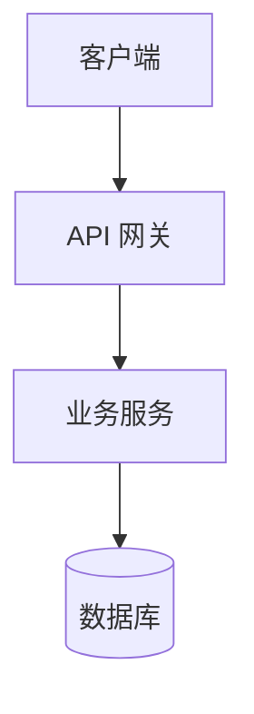
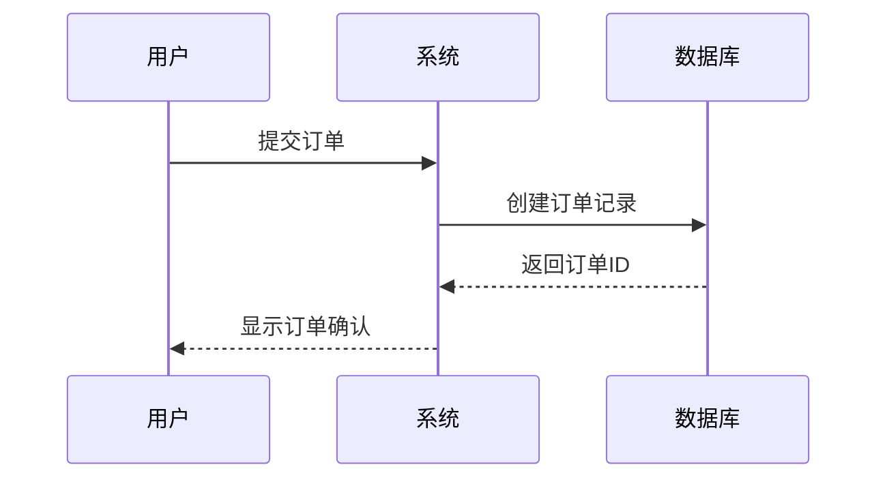

# 文档生成指南

## 文档类型

### 1. 项目概览 (overview.md)

包含内容：
- 项目简介（1-2 句话概括项目目的）
- 技术栈清单
- 主要功能特性
- 快速开始指南
- 目录结构说明

写作风格：
- 简洁明了，面向新用户
- 使用清晰的项目 Logo（如果有）
- 包含徽章（Build status, License, Version）

### 2. 架构文档 (architecture.md)

包含内容：
- 系统架构图（使用 Mermaid 语法）
- 模块划分说明
- 数据流图
- 技术选型理由
- 部署架构

图表规范：


### 3. API 文档 (api.md)

包含内容：
- 认证方式说明
- 错误码定义
- 接口列表（按模块分组）

接口格式：
```markdown
### POST /api/v1/users

创建新用户

**请求参数：**
| 字段 | 类型 | 必填 | 说明 |
|-----|------|------|------|
| name | string | 是 | 用户名 |
| email | string | 是 | 邮箱 |

**响应示例：**
```json
{
  "id": 1,
  "name": "张三",
  "email": "zhangsan@example.com"
}
```
```

### 4. 业务流程文档 (business-flow.md)

包含内容：
- 核心业务场景
- 时序图（使用 Mermaid）
- 状态流转
- 业务规则说明

时序图示例：


## 文档规范

### Markdown 格式

- 使用标题层级（# ## ###）
- 代码块指定语言
- 表格用于结构化数据
- 列表用于步骤说明

### 图表工具

- 优先使用 Mermaid 语法
- 复杂图表可引用外部图片
- 保持图表简洁，避免过度复杂

### 语言风格

- 使用技术术语准确
- 避免口语化表达
- 保持客观中立
- 适当使用示例说明

## 质量检查清单

生成文档后检查：

- [ ] 文档结构清晰，有目录导航
- [ ] 代码示例可运行
- [ ] 链接有效
- [ ] 图片显示正常
- [ ] 无拼写错误
- [ ] 格式渲染正确
